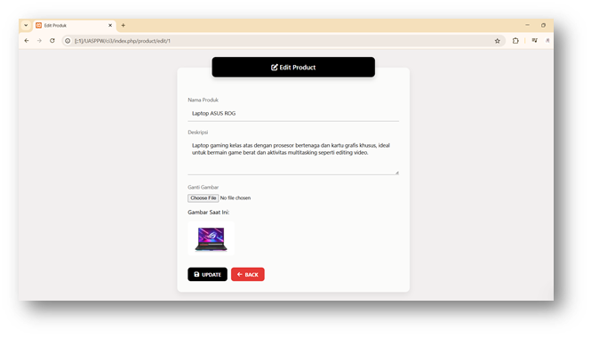

Siap Michael 🔥
Ini aku buatkan ulang dari awal versi **portfolio profesional + ada preview screenshot** + clean + rapi + siap bikin repo kamu keliatan niat 😎

Tinggal copy–paste jadi `README.md`

---

# 🚀 Aplikasi Katalog Produk (CRUD)

> Web Application berbasis CodeIgniter 3 dengan konsep MVC


---

## 📌 Tentang Project

Aplikasi ini merupakan sistem **Katalog Produk berbasis web** yang dibangun menggunakan framework **CodeIgniter 3** dengan menerapkan arsitektur **MVC (Model–View–Controller)**.

Project ini dibuat sebagai bagian dari **Ujian Akhir Semester – Mata Kuliah Perancangan dan Pemrograman Web**, dan dikembangkan sebagai bagian dari portfolio pengembangan web saya.

Aplikasi memungkinkan pengguna untuk mengelola data produk secara lengkap (Create, Read, Update, Delete) termasuk fitur upload dan pengelolaan gambar.

---

## ✨ Fitur Utama

* ✅ Menampilkan seluruh data produk
* ✅ Menambahkan produk baru dengan upload gambar
* ✅ Mengedit data produk
* ✅ Menghapus produk (gambar ikut terhapus otomatis)
* ✅ Flash message notifikasi (success & error)
* ✅ Validasi tipe file gambar (jpg, jpeg, png, gif)
* ✅ Sistem timestamp (created_at & updated_at)
* ✅ Tampilan UI clean dan modern

---

## 📸 Preview Tampilan

### 🏠 Halaman Utama


---

### ➕ Halaman Tambah Produk


---

### ✏️ Halaman Edit Produk



> Pastikan folder `images/` berada di root project dan berisi file screenshot di atas.

---

## 🛠 Teknologi yang Digunakan

* PHP
* CodeIgniter 3
* MySQL
* HTML
* CSS
* XAMPP

---

## 🧠 Konsep yang Diterapkan

Project ini mengimplementasikan:

* Arsitektur MVC
* File Upload Handling
* Session & Flashdata
* Database CRUD Operation
* Pengelolaan lifecycle file (upload & delete)
* Struktur folder sesuai standar CodeIgniter

---

## 📂 Struktur Project

```
application/
│
├── controllers/
│   └── Product.php
│
├── models/
│   └── Model_product.php
│
├── views/
│   ├── view_product.php
│   ├── add_product.php
│   └── edit_product.php
│
assets/
└── uploads/

images/
└── (screenshot project)
```

---

## 🗄 Struktur Database

### Tabel: `products`

| Field      | Tipe Data         |
| ---------- | ----------------- |
| id         | int (Primary Key) |
| nama       | varchar           |
| deskripsi  | text              |
| image_url  | varchar           |
| created_at | datetime          |
| updated_at | datetime          |

---

## ▶️ Cara Menjalankan Project

1. Install XAMPP / Laragon
2. Pindahkan project ke folder `htdocs`
3. Buat database baru (misalnya: `uas_katalog`)
4. Buat tabel `products` sesuai struktur di atas
5. Atur konfigurasi database di:
   `application/config/database.php`
6. Jalankan di browser:
   `http://localhost/nama-folder-project/`

---

## 🎥 Demo Video

Penjelasan dan demo fungsi CRUD:
👉 [https://youtu.be/x9PD0Ygu8tM](https://youtu.be/x9PD0Ygu8tM)

---

## 👨‍💻 Developer

**Michael**
Mahasiswa Sistem Informasi
Universitas Pembangunan Jaya
